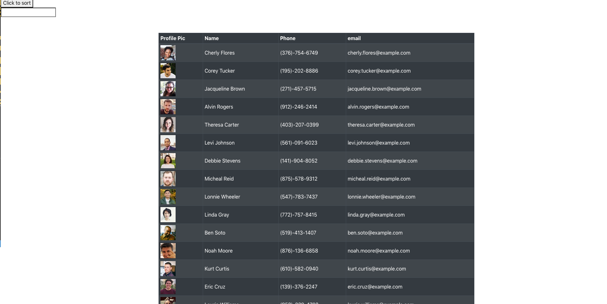

# React-Employee-Directory

  ## License
  
  This application is licensed under the Unlicensed license.

  

  ## Description 
  * This project is designed to search and filtr through a list of employees

  ## Links:

  * Deployed application Url: https://xtreme6007.github.io/React-Employee-Directory/
  * Github Repo: https://github.com/xtreme6007/React-Employee-Directory.git
  
  ## Tabel of contents

> * [Title / Repository Name]
>   * [About](#about)
>   * [Table of contents](#tabel-of-contents)
>   * [Installation](#installation)
>   * [Usage](#usage)
>   * [Screenshots](#sceenshots)
>   * [Resources (Documentation and other links)](#resources)
>   * [Contributers](#contributers)
>   * [License](#license)
>   * [Tests](#tests)
>   * [Questions](#questions)

## Instalation

N/A

## Usage

 Through the deployed on the browser

## Screen shots

## Resources

## Contributers
Contributers for this project were:

Preston Nichols

## Tests

N/A

## Questions?
GitHub UserName: xtreme6007@yahoo.com
GitHub Profile: https://github.com/xtreme6007@yahoo.com
Email: prestonnichols96@gmail.com
Please contact me via email for any further question.
